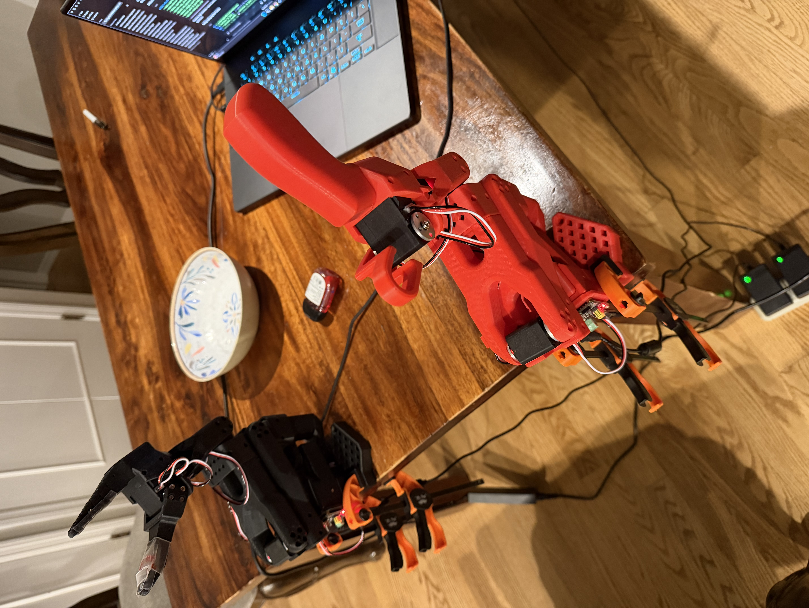

\# SO-101 Robot Arm — Teleoperation + Imitation Learning

A DIY robot arm build based on \[TheRobotStudio's SO-101](https://github.com/TheRobotStudio/SO-ARM100) open-source design, using Hugging Face's \[LeRobot](https://github.com/huggingface/lerobot) library. A teleoperated leader-follower pair trained via imitation learning (ACT) to autonomously perform pick-and-place tasks.

\## What this is

Two 6-DOF robot arms — a "leader" moved by hand, and a "follower" that mirrors it via live serial communication. Built from 3D-printed parts and Feetech STS3215 servos, controlled through Python via LeRobot. Demonstrations recorded via teleoperation are used to train ACT policies, so the follower can complete tasks autonomously without a human on the leader arm.

\## Trained tasks

| Task | Episodes |

|---|---|

| Pick up phone, place in corner | 38 |

| Pick up cup, pour into another cup | 50 |

| Pick up hand sanitizer, place in bowl | 50 |

\## Setup

Both arms mounted on the desk, camera fixed overhead, task objects in frame.

\## The arms

\## Teleoperation

Moving the leader arm drives the follower in real time over serial communication.

\## Build overview

\- \*\*Printed:\*\* Leader + follower arm bodies (PLA+, 0.2mm layer height, 15% infill) on a Creality K1 Max

\- \*\*Electronics:\*\* 12x STS3215 servos (mixed gear ratios for the leader, uniform for the follower), 2x Waveshare motor control boards, 2x power supplies

\- \*\*Software:\*\* WSL2 (Ubuntu 24.04) + Python + LeRobot for control/recording; Google Colab (T4 GPU) for training

\- \*\*Policy:\*\* ACT (Action Chunking Transformer), trained per-task on 38-50 demonstration episodes each

\- \*\*Gripper modification:\*\* added 3M tape brushed with baby powder to the gripper jaws to improve grip friction on smooth objects

\## Build notes \& gotchas

\- \*\*The BOM has two tables\*\* — "Parts for One Follower Arm" and "Parts for Two Arms." The leader and follower need different servo gear-ratio mixes, so double check before ordering.

\- \*\*Leader servo gear ratios aren't uniform\*\* — 1x 1/345 (C001), 2x 1/191 (C044), 3x 1/147 (C046). The follower's 6 servos are all 1/345. Label each motor as you configure it.

\- \*\*WSL2 doesn't have native USB passthrough.\*\* Every controller board and camera needs `usbipd bind` + `usbipd attach --wsl` from an admin PowerShell window — repeated after every unplug/replug or reboot.

\- \*\*Serial permissions in WSL\*\* — after attaching a USB device, `sudo chmod 666 /dev/ttyACM0` (or whatever port it lands on) before Python can open it.

\- \*\*UVC webcams over WSL can return corrupted frames\*\* unless MJPG format is explicitly forced in OpenCV.

\- \*\*`lerobot-setup-motors` uses different flags for leader vs. follower\*\* — `--teleop.type=so101\_leader` vs `--robot.type=so101\_follower`.

\- \*\*Match starting positions before teleoperating\*\* — the follower snaps hard to match the leader's position on connect.

\- \*\*`torchcodec` needs FFmpeg installed separately\*\* in WSL (`sudo apt install ffmpeg`), or training fails at the video-decoding step.

\- \*\*Local GPU training crashed repeatedly\*\* (hard system restarts) even after an NVIDIA driver update — moved training to Google Colab's T4 GPU, which has been stable.

\- \*\*Freshly-trained ACT policies can be "twitchy"\*\* — hesitating and reverting to a default pose instead of committing to an action. Fixed by running inference with `--policy.temporal\_ensemble\_coeff=0.01` and `--policy.n\_action\_steps=1`.

\- \*\*`lerobot-rollout` dataset names must start with `rollout\_`\*\* when recording during evaluation.

\## Status

\- Leader and follower arms assembled and calibrated

\- Live teleoperation working end-to-end

\- Camera integration via WSL passthrough

\- Three imitation-learning policies trained and evaluated

\- Autonomous policy execution confirmed on physical hardware

\## Roadmap

1\. SO-101 leader-follower teleoperation

2\. Imitation learning on recorded demonstrations

3\. Build the \[AmazingHand](https://github.com/pollen-robotics/AmazingHand) — open-source 3D-printed robotic hand

4\. Camera-based hand-pose retargeting (replace the physical leader arm with real-time hand tracking)

5\. Integrate the AmazingHand onto the follower arm into one control loop

\## Acknowledgments

\- \[TheRobotStudio](https://www.therobotstudio.com) \& \[Hugging Face](https://huggingface.co/lerobot) for the open-source SO-101 design and LeRobot library

\- \[Pollen Robotics](https://www.pollen-robotics.com) for AmazingHand

